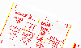

# Comparator Feedback

The background here is that when we first began using Playwright we were having issues with screenshot comparison, especially when there was text involved. Researching the issue, it seemed to be related to differences in rendering, especially anti-aliasing, between different browser builds. Darwin vs. Linux, amd64 vs arm64, and headful vs. headless vs headless=new. A couple issues mentioned trying the new experimental comparator `ssim-cie94` and provide feedback. This is that feedback.

## The Problem
Everything was working pretty much fine with the new comparator, but we noticed more failures on screenshots. Tracking it down, I realized that reverting back to the old `pixelmatch` comparator would pass the tests and allowed fine tuning how strict we wanted to be on rendering differences using the `threshold` setting. 

The two images that I used for testing were these. One was created with chromium-darwin with the old headless mode and the other was the same but with the new headless mode. I don't remember which is which, but for the sake of comparison, I'm not sure it matters. What you see in the image is a JPEG in an `img` tag that has been scaled and rotated with CSS.

The following images used the `ssim-cie94` comparator with `threshold` settings of 0.01, 0.20, and 0.90. I know the `ssim-cie94` comparator is zero-config, so I wouldn't expect the threshold to affect it, but I wanted to show that I did test that. 

The following images are what I got when I used the `pixelmatch` comparator with `threshold` settings of 0.10, 0.20, and 0.25.

## Conclusion
We are continuing to use the `ssim-cie94` comparator as the default as I would assume that if it turns out to be better it will someday be the default. We have also mitigated the issue to some extent by fixing our configuration and local settings to make sure we are always running either headful of with the new headless mode to avoid rendering differences as much as possible. That still results in some failures on certain screenshots, and on those we are reverting to the `pixelmatch` comparator on a test-by-test basis.

## References
- [#24312](https://github.com/microsoft/playwright/issues/24312)
- [#20097](https://github.com/microsoft/playwright/issues/20097)
- [#13873](https://github.com/microsoft/playwright/issues/13873)